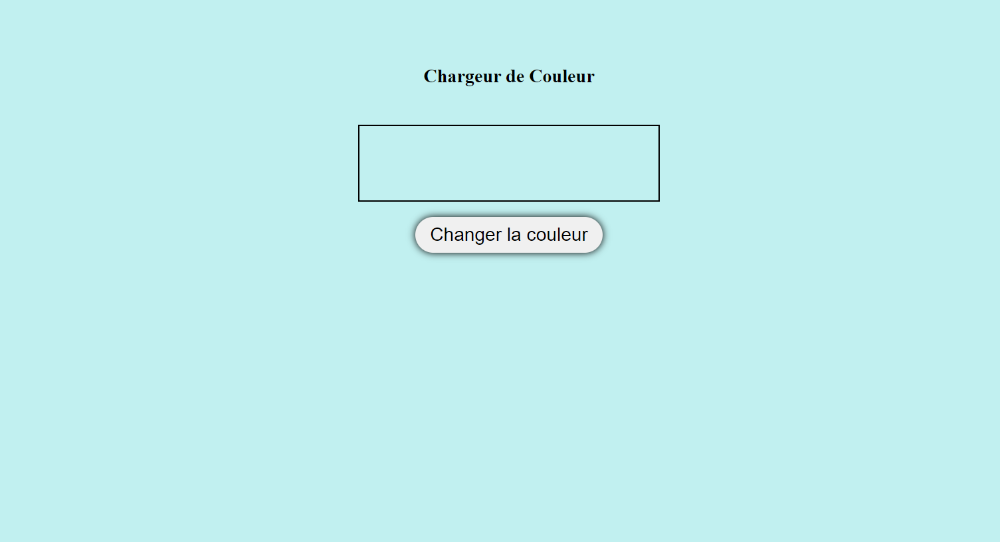
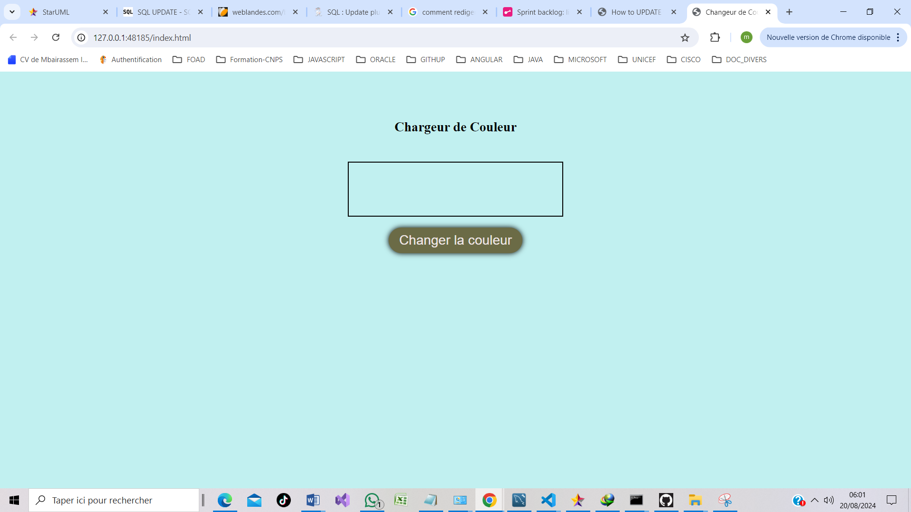
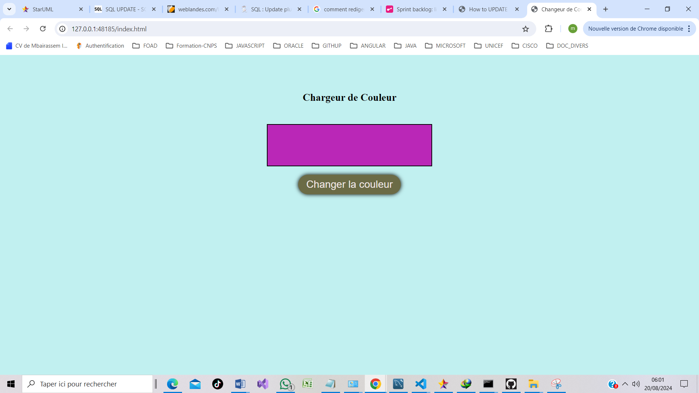

# Projet Changeur de couleur Arrière-Plan

Ce projet vise nous familiariser avec les notions de javascript tel que : 

* Manipulation du DOM
* La gestion des évènements avec DOMContentLoaded

## Exemple

